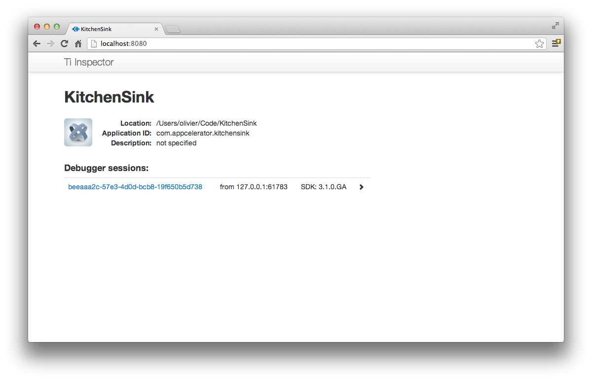
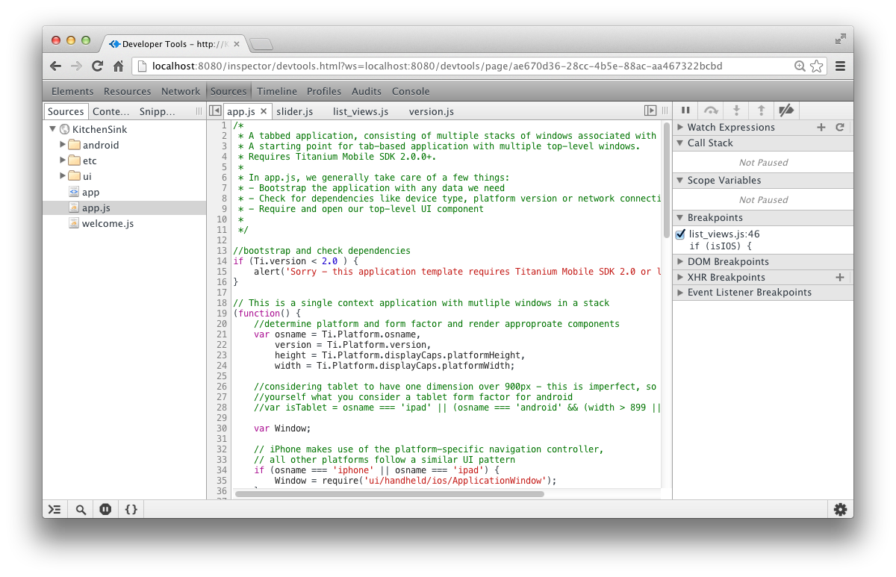

#Ti Inspector

Ti Inspector allows debugging Appcelerator Titanium applications in the Chrome DevTools web interface.

The tool acts as a gateway by translating commands and messages between the [Chrome DevTools Debugging Protocol](https://developers.google.com/chrome-developer-tools/docs/protocol/1.0/) and the [Titanium Debugger Protocol](http://docs.appcelerator.com/titanium/latest/#!/guide/Debugger_Protocol) (and vice-versa).

Currently only the iOS target platform is supported.

##Motivation
Since my Titanium development workflow mainly revolves around Sublime Text and the CLI, and firing up Titanium Studio for tracking down bugs in the integrated debugger is most of the time a painfully slow activity (start the IDE, rebuild for debugging, etc.), I wanted a more agile way to fire up a JavaScript debug session. Moreover, when debugging native modules in Xcode, sometimes it would be nice to have a view on both sides (JS and native) of the code.

You can find a more detailed post and a short demo [here](http://titaniumninja.com/debugging-titanium-apps-with-chrome-devtools/)

##NOTE - Titanium SDK 3.5.X

Currently Ti Inspector doesn't work correctly with Ti SDK 3.5.X.
Since the 3.5.0 release, Titanium underwent major changes regarding the JavaScriptCore engine and its debugger library (`libti_ios_debugger.a`).
In particular, the currently known issues are:
* [Does not recognize nor stops on breakpoints](https://github.com/omorandi/TiInspector/issues/25)
* [Ti SDK 3.5.X: sudden app termination](https://github.com/omorandi/TiInspector/issues/26)

The former is also seen in the Ti Studio debugger. Follow and watch [https://jira.appcelerator.org/browse/TIMOB-18616](https://jira.appcelerator.org/browse/TIMOB-18616) for additional info.

While these issues are being worked on, as a temporary solution, Ti Inspector can be used by building the app with Ti SDK 3.4.1.GA during debugging

##Install

For running Ti Inspector a working [node.js](http://nodejs.org/) setup is required.

The Ti Inspector module can be installed through npm with

~~~
    $ [sudo] npm install -g ti-inspector
~~~

##Dev install
In alternative, if you like to stay on the edge, you can pull the code from github and use `npm link`:

~~~
  $ git clone git@github.com:omorandi/TiInspector.git
  $ cd TiInspector
  $ npm install
  $ [sudo] npm link
~~~

##Using Ti Inspector

The `ti-inspector` script can be invoked from the command line with the following arguments:

~~~
    ti-inspector [Options] [TiProjectDir]

    options:
       --web-host=[host]      host for the inspector server (default localhost)
       --web-port=[port]      port for the inspector server (default 8080)
       --debugger-port=[port] port for the Titanium debug server (default 8999)

    TiProjectDir:
       Directory containing a Titanium app project.
       If not specified, the current directory is used.
~~~

Supposing you have a terminal open on a directory containing the Titanium project you want to debug you can simply issue:

~~~
    $ ti-inspector
~~~

which runs the script with the default argument values, then point the browser to http://localhost:8080 where a web page for the current project is shown, telling that no active debugging session is present.

In order to start the Titanium application for debugging it, you have to use the Titanium CLI `build` command, using the `--debug-host` hidden option. For example:

~~~
    $ titanium build -p iphone --debug-host localhost:8999
~~~

The `--debug-host` argument represents the `host:port` pair where the debug server is listening. This is normally provided by Titanium Studio when the project is started in debug mode, however in our case Ti Inspector will act as a debug server (listening by default on tcp port 8999) for the running app.

Once the app is running in the iOS Simulator, only the splash screen will be visible, while in the page previously opened in the browser will list the current debug session:

By clicking on it, the DevTools page will be open, showing the `app.js` file source code.

From there on, you can debug your application by setting breakpoints, stepping through code, watching variables, or evaluating expressions in the console panel, etc.

## Features

* Breakpoints: setting/removing breakpoints, conditional breakpoints
* Call stack inspection (when execution is suspended)
* Variables and objects inspection
* Watch expressions
* Step operations (step over, step-into, step-out)
* Console logging
* Expression evaluation in the console (only when execution is suspended)
* Suspend on exceptions (disabled by default)
* Direct source editing and CMD-S for saving changes in your original JS files

## Limitations

* Android is not currently supported: supporting Android will mean implementing the [V8 remote debugging protocol](https://code.google.com/p/v8/wiki/DebuggerProtocol) in Ti Inspector.
* On device debugging is not supported since it's treated in a special way by the CLI and Studio, though there exist some hackish ways for enabling it in a semi-manual way
* Expressions can only be evaluated when the execution is suspended
* TiAlloy (and any other, e.g. CoffeeScript) source mapping is not supported
* Multiple contexts (e.g. Ti.UI.Windows created through the `url` property) are not correctly handled

## Themes FTW (available from V. 0.0.3) - NOTE: NOT WORKING SINCE v0.1.2

The DevTools app styling can be customized quite easily and some open source custom css are available from [http://devthemez.com/themes/chrome-developer-tools](http://devthemez.com/themes/chrome-developer-tools).
These can also be used with Ti Inspector, which already includes some in the `public/themes/` directory.

### Adding a custom Theme
If you don't like the already available themes, you can download one from [http://devthemez.com/themes/chrome-developer-tools](http://devthemez.com/themes/chrome-developer-tools), then:
* locate the directory where Ti Inspector has been installed by npm, which is probably `/usr/local/lib/node_modules/ti-inspector`. Let's call it `$INSTALL_DIR`
* Copy the downloaded css file to `$INSTALL_DIR/public/themes`
* set the `TiInspector.preferences.devtools_theme` property in the `$INSTALL_DIR/public/preferences.js`  file  accordingly
* start Ti Inspector, or simply reload the inspector panel if already running, and enjoy your new theme

## Changelog

### 0.1.2
* Upgraded devtools to latest Blink revision
* Fixed breakpoint handling

### 0.1.1
* Fixed breakpoints handling in platform-specific files (full Ti 3.2.0 support)

### 0.1.0
* Fixed issues caused by latest versions of Jade in the inspection dashboard
* Fixed listing of platform-specific files (issue #16)

### 0.0.5
* Fixed websocket errors in latest Chrome Version 30.0.1599.66 (issue #7)
* Enabled console panel persistence across reloads (issue #3)

### 0.0.4

* Added "Debugger.pause" command handling
* Fixed dashboard app not showing debug sessions (issue #5)
* Updated devtools to stable Chrome 29.0.1547.65 and fixed Cobalt.css theme

### 0.0.3

* Automatic reload of the DevTools panel when a new debugging session is started: no need to go back and forth from the dashboard. Simply reload your app and Ti Inspector will restart
* Basic support for Chrome DevTools custom themes (chose a theme in the `public/js/preferences.js` file and reload the web app in the browser)

### Credits
Ti Inspector was originally inspired by [node-inspector](https://github.com/node-inspector/node-inspector), started by (Danny Coates)[https://github.com/dannycoates]

## License

See LICENSE file

